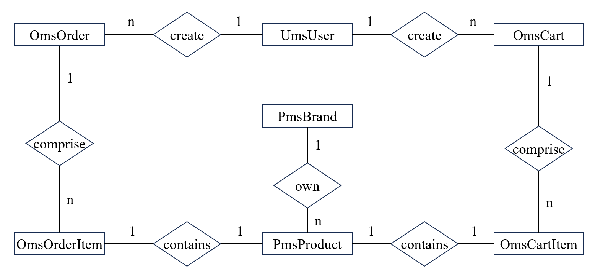

# Welcome to SpringBootMall

### 项目介绍

基于Spring Boot的商城项目，包括商品管理、订单管理和用户管理，采用Docker容器化部署。商品管理包括商品检索、销量排行榜等，订单管理包括购物车、限时抢购、秒杀等，用户管理包括登录、注册等。

### 业务需求

* 商品管理
  * 品牌增删改查
  * 商品增删改查
  * 品牌缓存
    - [X]  Redis (String + List)
      - Hash存储<"brand:" + "brandId:" + brandId, brand>，设置过期键
      - List存储<"brand:" + "allBrandIds", brandIds>
  * 商品缓存
    - [X]  Redis (String + List)
      - Hash存储<"product:" + "productId:" + productId, product>，设置过期键
      - List存储<"product:" + "allProductIds", productIds>
  * 销量排行榜
    - [X]  Redis (Sorted Set)
      - Sorted Set存储<"product:" + "sales", product, sale>
  * 商品检索
    - [X]  ElasticSearch
* 订单管理
  * 购物车增删改查
  * 订单增删改查
  * 购物车缓存
    - [X]  Redis (Hash + List + String)
      - Hash存储<"cart:" + "cartId:" + cartId, cart>, <"cart:" + "cartItemId:" + cartItemId, cartItem>，设置过期键
      - String存储<"cart:" + "userId:" + userId, cartId>
      - List存储<"cart:" + "allCartIds", cartIds>, <"cart:" + "allCartItemIdsOfCartId:" + cartId, cartItemIds>
  * 订单缓存
    - [X]  Redis (Hash + List)
      - Hash存储<"order:" + "orderId:" + orderId, order>, <"order:" + "orderItemId:" + orderItemId, orderItem>，设置过期键
      - List存储<"order:" + "userId:" + userId, orderIds>
      - List存储<"order:" + "allOrderIds", orderIds>, <"order:" + "allOrderItemIdsOfOrderId:" + orderId, orderItemIds>
  * 订单超时处理
    - [X]  ~~Redis (过期事件)~~
      - notify-keyspace-events Ex
    - [ ]  RabbitMQ (消息TTL+死信Exchange)
  * 限时抢购
    - [ ]  Redis (过期键) + RabbitMQ (消息TTL+死信Exchange)
  * 秒杀
    - [ ]  读写分离 + Redis哨兵模式 + RabbitMQ镜像集群
    - [ ]  超卖？
* 用户管理
  * 用户增删改查
  * 账号密码登录
    - [X]  Spring Security (PasswordEncoder)
  * 手机号登录
    - [X]  Redis (过期键)

### 技术选型

| 技术 | 说明 | 官网 |
| --- | --- | --- |
| SpringBoot | Web应用开发框架 | [https://spring.io/projects/spring-boot](https://spring.io/projects/spring-boot)|
| MySQL | 关系型数据库 | [https://www.mysql.com/](https://www.mysql.com/) |
| MyBatis | ORM框架 | [https://blog.mybatis.org/](https://blog.mybatis.org/) |
| Redis | 内存数据存储 | [https://redis.io/](https://redis.io/) |
| RabbitMQ | 消息队列 | [https://www.rabbitmq.com/](https://www.rabbitmq.com/) |
| ElasticSearch | 搜索引擎 | [https://www.elastic.co/elasticsearch](https://www.elastic.co/elasticsearch) |
| MongoDB | NoSQL数据库 | [https://www.mongodb.com/](https://www.mongodb.com/) |
| Docker | 容器 | [https://www.docker.com/](https://www.docker.com/) |
| Lombok | Java语言增强库 | [https://projectlombok.org/](https://projectlombok.org/) |
| Hutool | Java工具类库 | [https://hutool.cn/](https://hutool.cn/) |


### 项目结构

```text
├─docs
│  ├─img        # 图片
│  ├─intro      # 介绍
│  └─sql        # MySQL脚本
├─src
│  ├─main
│  │  ├─java
│  │  │  └─com.example.springbootmall
│  │  │    ├─component              # 组件
│  │  │    ├─config                 # 配置文件
│  │  │    ├─controller
│  │  │    ├─dao
│  │  │    ├─domain
│  │  │    ├─model
│  │  │    ├─repository
│  │  │    └─service
│  │  └─resources
│  │      ├─application.yml
│  │      └─dao
│  └─test
├─.gitignore
├─Dockerfile
├─pom.xml
└─README.md
```

### 数据库

* ER图



* 数据表
  * pms_brand (id, name, first_letter, factory_status, brand_story)
    * factory_status: 是否为品牌制造商：0->不是；1->是
  * pms_product (id, brand_id, name, description, keywords, price, sale, stock)
    * keywords: 服装，手机数码，家用电器，家具家装，汽车用品
  * ums_user (id, username, password, nickname, phone, email, gender, create_time, birthday)
    * gender: 性别：0->未知；1->男；2->女
  * oms_order (id, user_id, status, create_time, payment_time, delivery_time, receive_time, comment_time, update_time)
    * status: 订单状态：0->待付款；1->待发货；2->已发货；3->已完成；4->已关闭；5->无效订单
  * oms_order_item (id, order_id, product_id, product_quantity)
  * oms_cart (id, user_id, status, create_time, update_time)
    * status: 购物车状态：0->正常；1->已删除
  * oms_cart_item (id, cart_id, product_id, product_quantity)
* 创建数据库并导入数据
  ```shell
  create database mall_tiny;
  use mall_tiny;
  source mall_tiny_filled.sql;
  ```
* 一些不合理的约束
  * 一个用户只能有一个购物车 (用来在添加购物车时判断购物车是否存在)
  * 品牌名不能相同（用来在添加品牌时判断品牌是否存在）

### 练习

* MySQL
  - MySQL增删改查？
    - [X] 品牌，商品，用户，购物车，订单
  - 索引？
  - 读写分离？
  - 分库分表？
* Redis
  - Redis的应用场景？
    - [X] 缓存
    - [X] 排行榜
  - 内存管理？
    - [ ] 删除过期键 -> 定期删除
    - [ ] 内存淘汰机制 -> allkeys-lru
  - 持久化？
    - [X] AOF
  - 一致性？
    - [X] Cache Aside Pattern -> 异步重试(消息队列)
  - 缓存穿透？
    - [X] 布隆过滤器
  - 缓存雪崩？
    - [X] 设置不同的过期时间
    - [X] 集群
  - 高可用？
    - [X] 哨兵模式（一主二从三哨兵）
* RabbitMQ
  - RabbitMQ的应用场景？
  - 幂等性？
  - 可靠性？
  - 顺序性？
  - 高可用？
    - [ ] 镜像集群
* ElasticSearch
  - ElasticSearch的应用场景？
* 高并发？
  - [X] 使用缓存
  - [ ] 优化数据库查询（SQL语句，索引）
  - [ ] 使用消息队列解耦和异步处理
  - [ ] 限流与降级
  - [X] 优化数据库连接池
  - [X] 优化Tomcat线程池