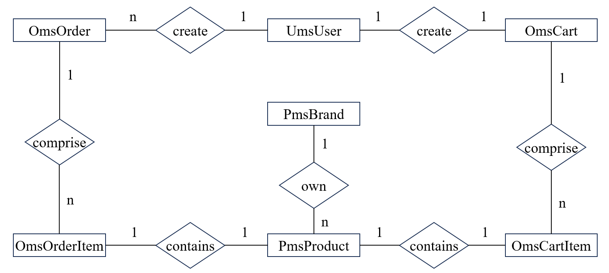

# Welcome to SpringBootMall

### 数据库
* ER图

* 数据表
  * pms_brand (id, name, first_letter, factory_status, brand_story)
    * factory_status: 是否为品牌制造商：0->不是；1->是
  * pms_product (id, brand_id, name, description, keywords, price, sale, stock)
    * keywords: 服装，手机数码，家用电器，家具家装，汽车用品
  * ums_user (id, username, password, nickname, phone, email, gender, create_time, birthday)
    * gender: 性别：0->未知；1->男；2->女
  * oms_order (id, user_id, status, create_time, payment_time, delivery_time, receive_time, comment_time, update_time)
    * status: 订单状态：0->待付款；1->待发货；2->已发货；3->已完成；4->已关闭；5->无效订单
  * oms_order_item (id, order_id, product_id, product_quantity)
  * oms_cart (id, user_id, status, create_time, update_time)
    * status: 购物车状态：0->正常；1->已删除
  * oms_cart_item (id, cart_id, product_id, product_quantity)
  * 创建数据库并导入数据
    ```shell
    create database mall_tiny;
    use mall_tiny;
    source mall_tiny_filled.sql
    ```


### 业务需求
* 商品管理
  * 添加品牌，删除品牌，更新品牌信息，查询品牌信息
  * 添加商品，删除商品，更新商品信息，查询商品信息
  * 搜索商品
    - [ ] ElasticSearch
* 订单管理
  * 创建订单，删除订单，更新订单信息，查询订单信息
  * 创建购物车，删除购物车，更新购物车信息，查询购物车信息
* 用户管理
  * 添加用户，删除用户，更新用户信息，查询用户信息
  * 获取验证码，判断验证码是否正确
    - [x] Redis 

### 测试用例
* PmsBrandDaoTest -> PmsProductDaoTest -> UmsUserDaoTest -> OmsCartDaoTest -> OmsCartItemDaoTest -> OmsOrderDaoTest -> OmsOrderItemDaoTest 